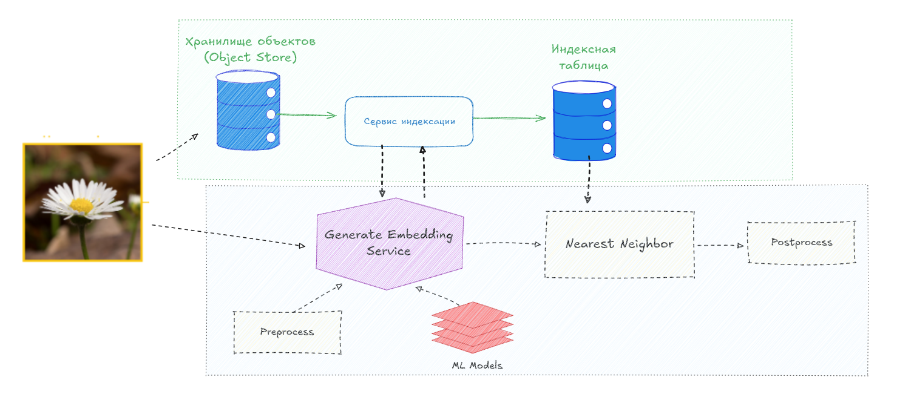
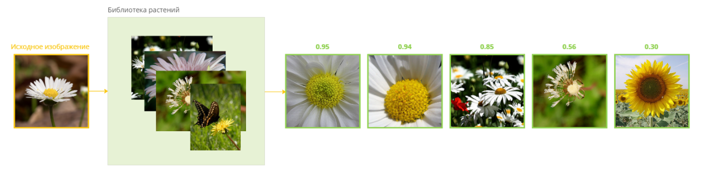

# Flowers Recognition

## System Design

### What inside

    - ViT
    - Faiss(KNN)
    - Docker
    - FastAPI

## Example output

supervised contrastive loss

## Code Examples

*Weights have to be here: models/best_model.pt*

## Что можно улучшить:

- Можно обучить модель побольше
- Quantizatiom, Prunning, Distilation
- Перенести вычисления Faiss на GPU.
- Если нам нужны более точные совпадения и мы не обрабатываем много  то можно использовать KNN
- Индексация повышает затраты памяти, потому что в индексной таблице сохраняются эмбеддинги целых изображений. Сократить затраты памяти позволяют различные методы оптимизации — такие, как векторное квантование и квантование по произведению (PQ, Product Quantization)
- Python плохо работает для быстрой обработки изображений, нет потоков и нормальнной ассинхронности, по-этому я бы заменил FastAPI на TorchServer.